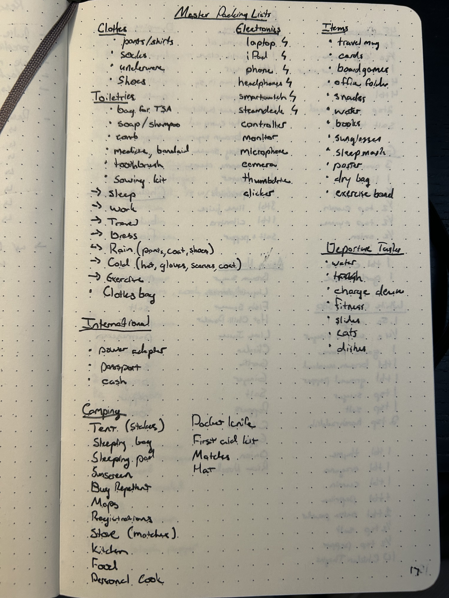

Travel can be an opportunity to see and explore new cultures. I've had the chance to do a lot of traveling with work. Here are some of the things I've learned along the way. 

# Packing

## What to Pack

What you bring on a trip can meaningfully affect the comfort of your trip. If you are anything like me, the default thing to do is to bring more than you need, resulting in additional hassle and weight. However, I've also forgotten important items that I later regretted not having. The tips in this area reflect how I pack for all kinds of trips. 

Sometimes you want slightly different items depending on the context.  For example:

- **Water bottle** for flight travel (optimizing for temperature) vs backpacking (optimizing for weight and capacity).  
- **iPad vs Laptop** for personal/work travel and weight/capability/battery life.  
- **Cold Weather Gear**, depending on the expected low and weather, trade off with weight and bulk
- **Shoes**: dress, rain/water, workout, running, walking.  I seldom pack more than 2 types of shoes, given the space they take up
- **Bag Size** according to what you need to carry.  I have (3L, 20L, 28L, and 45L) bags.  Sometimes I carry a smaller bag in a larger bag. When purchasing a bag, consider the sizes of carry-on and personal items allowed by the airlines you most frequently fly. 

For toiletries, prefer re-packable toiletries containers to both reduce waste and better choose products that work for you regardless of size.  Sometimes there are special tools for this.  For example toothpaste, there are refill valves.

I recommend using a master packing list and update it regularly. As you consider the items on your list, measure and weigh your items to understand what size backpack you need and where you can optimize weight and bulk.
I also Include in the packing list a to-do list for critical leaving items, such as taking out the trash, feeding pets, etc.
Here is a copy of my packing list:

Here are a few of the things that have strong opinions on

1. **Backpack**: Aer Travel Pack 3 Small.  It fits most personal item size capacities. I like its admin panel, hip stack and harness system, large clam shell compartment, and water bottle compartment.
1. **Sling**: Tomtoc Aviator-T33 3.5L.  It is perfectly sized to carry all the things I need quick access to while on a plane, and most of my every day carry items when I'm at my destination.
1. **Toiletries**: Aer Dopp Kit 3. sits up on its own, and has clear places for everything I need.  I have a small plastic bag for when they need to be remove to go through TSA. 
1. **Notebook**: Moleskin Medium Hardcover Dotted.  Works great a bullet journal and the hardcover protects the pages.  It fits perfectly in the sling.
1. **Pens**: 0.3mm Pilot G-2.  Smooth writing experience in a fairly cheap pen.  I carry a few different colors.
1. **Pencil**: 0.5mm Pentel Orenz - a very smooth automatic pencil with great lead protection.
1. **Headphones**: Airpods Pro 2.  Great noise cancellation, tiny form factor, find my support.
1. **Water Bottle**: 1.4L Nalgene, Grayl Purifier Bottle, or Yeti 20oz Tumbler depending on if I need capacity, purification or insulation.
1. **Smartwatch**: Garmin Forerunner 55.  I prefer its hardware controls, long battery life, and fitness tracking features.
1. **Entertainment**: Steamdeck vs XBox Controller.  Steamdeck is better for longer trips, but an iPad+Xbox controller is perfectly suitable for shorter trips.  The XBox controller has better 3rd party support than the Steamcontroller.
1. **Deck of Cards**: requires no power, limited space, and supports a ton of games
1. **Sweeter** a Moreno Wool Sweater. Surprisingly warm for its space and weight.  My current one we got used.  In slightly colder weather, I have a Port Authority light jacket which works well and is fairly breathable.
1. **Pants**.  I prefer pants with good pockets and a professional look.  I like the BSA polyester microfiber uniform switchback pants for travel as they provide a good mix of comfort, breathability, and pockets.  They also double as workout shorts/pants.  I also like the Columbia Sportswear Men's Vast Canyon Omni-Heat Infinity Softshell Pants as a good business casual trouser that packs down well.  For colder weather, I like Duluth Firehose Cargo Pants.
1. **Shoes**: Reebok Nano Shoes great for functional fitness and general use or Solomon X Ultra 5 Mid GORETEX boots waterproof and great support for longer walks.
1. **Charging** USB-C based cables for everything charging related.  This allows de-duplicating between devices.

## Packing for Weather

When choosing clothing, I recommend:

- Traveling in layers, including those for cold, wind, and water resistance.  For example a long underwear, scarf, hat, and gloves can really add some temperature resistance in cold weather.
- Plan for worse weather than expected. I typically plan for comfort ±10ºF from the forecasted temperatures
- Plan for getting soaked because being soaking wet can be highly uncomfortable.  I bring a spare pair of dry socks and a base layer in case of heavy rain
- For example, Moreno wool and materials matter for temperature regulation and Oder suppression, but modern synthetics can be unparalleled in terms of both water resistance and breathability.

## Packing to stay healthy

Exercise can be harder to work in depending on your routine and needed resources. Calisthenics exercises can be a good but time-consuming option. Also, some exercise programs, such as CrossFit, have options for drop-in passes to use a different gym while traveling. I personally carry a heavy resistance band as a way to get a bit more out of my calisthenics while not taking too much space when Gyms are not available. 

Another harder aspect when traveling is maintaining a healthy food/diet. Eating healthy while traveling is extremely difficult. Restaurants (at least in the US) tend to serve fattier foods than if you carefully controlled the preparation of these foods at home. Additionally, you may not have access to the same selection of foods you'd have at home, making certain choices harder. While traveling, I often find that a larger breakfast is a good decision because healthier versions of these foods can more easily be found while traveling. I also prefer to get certain items from a grocery store over restaurants that can be prepared using at most hot water, which can be produced using the coffee machine in most hotel rooms by omitting the coffee.

## Packing Your Bag

A few tips regarding the practical packing of the bag itself.
I Prefer a large single compartment combined with packing cubes to provide organization. They also pack more quickly as a “modular” go-bag system.  I have specialized pouches for tech, admin (e.g., notepad, pens), weather (e.g., rain, cold), and toiletries, which can be useful to locate and pack frequently used items quickly.
Within these cubes, learning to do a proper [Ranger Roll](https://www.artofmanliness.com/skills/how-to/how-to-pack-a-bag-using-the-ranger-roll/) inside the packing cube can increase capacity.
Additionally, when you have large hollow things like shoes pack inside of them to save volume.

Understand how the loading of the pack also affects comfort.  Keep heavy items near your hips and back, where they are most supported can make carrying them all day easier.

- For any bag over a few liters, a hip belt, chest strap, and load lifter straps can substantially improve the comfort of a backpack
- Single shoulder straps are a recipe for shoulder pain with a long day if they have more than a few pounds.

- The "10 essentials" from scouts when camping are still good advice when packing for the outdoors:
	- pocket knife
	- sun protection
	- Flashlight
	- first aid kit
	- rain gear
	- Matches or fire starters
	- food
	- water bottle
	- map and compass
	- Extra clothing 

## Offline Digital Packing

Internet on planes and in some remote areas can be expensive or limited. Sometimes it is helpful to disconnect entirely, but when you still need or want to do something, having a plan to do work or relax without the internet can be done with some planning. Here are some of the programs I use offline:

- **Syncing Files**: Git for code, Drafts for notes, Box/Google Drive for certain other files
- **Google Docs**, Slides, and Sheets have an offline mode that can be accessed and edited when using Google Chrome. 
- **Documentation**: Zotero for academic papers and references, and Zeal for software documentation. 
- **Music and Entertainment**: FinAmp is offline streaming for Jellyfin, Steaming Apps offer offline storage at premium tiers, podcast apps have had download features forever, RetroArch, even on iOS, provides an easy way to play classic games in an offline way. A tablet + an Xbox controller is a compact way to game on the go, especially if you already bring the iPad for something else. 
- **Odd Files** Maintain a “scratch” folder distinct from /tmp, where scratch persists across reboots

In addition to preparing to be offline, using a VPN like [Tailscale](http://tailscale.com/) to give access to files and resources in your home network rather than carrying everything with you. 

While not a way to prepare for being offline per se, preparing your device with full disk encryption is an important way to protect files if a device is lost or stolen. Likewise, if using a VPN, you should configure key expiration for devices that travel with you. 

# Air Travel

If you don't do it a lot, Air Travel can be stressful. Here are a few aspects that made it easier for me. 

## Pre Air Travel

There is a lot you can do to make your trip easier by preparing in advance:

Some things you can do signifigantly in advance of travel.
This begins with how you pick your flights.  Unless you travel a lot (12+ times a year), points and status don't matter, but perks like free checked bags, free rebooking within 24 hours, and priority service are handy if you do. 
Next, services like pre-check and Global Entry save time, but not tons, depending on your airport, mostly from not having to remove shoes and large electronics, and maybe slightly shorter lines.  I found it saved the most time at airports with notorious security lines like Chicago and Atlanta.
On a related note, don't underestimate the utility of a passport as it is required for international travel and take significant time to obtain, but even domestically as it proves both citizenship and identity providing utility outside the travel context.

When it comes time to checkin 24 hours before the flight, always check in where possible with the app ahead of time, and avoid lines at the airport

When packing, I prefer single (personal item only) bag travel for air travel. I like a backpack because it's less likely to be taken from you if overhead bin space is short; it also doesn't get stuck in the sand/mud

## Day of Travel

I Always assume that international flights will be slightly cold, and plan accordingly with a lightweight sweater and pants. 
Likewise you want easy access to your pockets, so travel with pants with thigh pockets, as these can be easier to access than waist pockets while seated.
From a digital perspective, having a travel focus mode for your phone that makes the apps, tickets, navigation tools, and itineraries you need quick at hand. 

When going through security, having an empty bag compartment/sling for your pocket contents makes going through security easier. 
Likewise, non-moist foods can be brought through domestic airport security and can be cheaper and tastier than airport food.
However, If you need to buy food because you couldn't pack it, mobile order food in airports for shorter lines because the checkout is a significant bottleneck. 

Once you are on the flight there are a few things you can do to make the travel nicer:

- **Work**? This requires some planning in advance, but flights are a good time to work on heads down tasks that don't require online research.  See the section on digital packing for advice.
- **Sleep**? Depending on the timezone difference, sleep is a good options, but practically for me, mostly a lost cause, but resting is possible.  Noise cancellation headphones and an eye mask help me to relax on flights 
- **Entertainment**?  Considering downloading books, movies, and podcasts in advance. Native phone games or even [emulators such as RetroArch](https://www.retroarch.com/) for games you have a [legal right to own](https://www.law.cornell.edu/uscode/text/17/117) can also be a way to pass the time.

Lastly, if or when your flight gets canceled or substantially delayed, gate agents can typically do more than you can on an app.  Specifically, even if your airline doesn't have a flight going to your destination, if another airline does, you may be able to get the gate agent for an endorsed ticket on another airline at no cost to you.

# Rail and Bus Travel

While often not practical for inter-city travel in the United States, major metropolitan areas often have metro systems, which can be an efficient form of transport to common destinations especially if you traveled to the location by air and do not have a car. When considering intercity rail, consider the time of day. In the US, some metro systems become less safe at night.  As for how to pay for the train, increasingly, metro systems have a pay-by-phone or credit card option over traditional card or ticket-based systems. These can be more reliable and convenient.  Lastly, while traditional map apps like Google Maps increasingly have reliable schedules, apps like [Citymapper](https://citymapper.com/) do a better job of helping navigate intracity trains and multimodal connections. 

# Backpacking

For me, backpacking is a relaxing way to disconnect, but because it puts you out in the wilderness, it requires appropriate preparation.  Some unique or special considerations when backpacking include:

- Of utmost importance is to manage your water supply and have a way to obtain more purified water.  You can go days without food, but only at most three days without water depending on conditions. For purifying water, purification tablets are lightweight, but taste bad. I prefer a pump or a [sawyer squeeze](https://www.sawyer.com/product/squeeze-water-filter-system). There is also a Squeeze Mini, but its back pressure is much higher, making it more painful to use. 
- Weight matters of second importance for comfort when you carry everything on your back. Carefully weigh the weight vs. the value of each item. Lighter gear can dramatically improve your experience carrying if you backpack often, but it can be very expensive and often less comfortable when used than heavier options. 
- Staying dry matters of third importance. Moisture decreases the effectiveness of thermal properties of equipment and increases the odds of blisters. 

Some nice to haves:

- Good shoes/boots to prevent blisters and provide support to prevent sprains/injuries cannot be understated. A good pair of boots will protect your arches with a shank and will protect your ankles from twisting on uneven ground. However, they need to be broken in by wearing them for 20-30 miles before being relied on for extensive trips. Full leather boots take longer to break in. Consider waterproof or resistant boots for wet environments. 
- Consider packing a spare set of lighter “camp” shoes if practical to have a more comfortable way to relax in camp and allow your feet to breathe. 
- Hiking poles take a lot of pressure off your knees when going up or down hill, and can be reused as part of your shelter. 
- Plan as needed for wildlife, including things like bear bags for food and toiletries. 
- For cooking,  freezer bag cooking, which can be prepared in a single bag using only hot water, yields less mess and cleanup. 
- For sleeping,  consider hammock camping where allowed and practical as a lightweight and comfortable way to sleep. 

# Road Travel

Road trips can be significantly cheaper than flights if time allows.

For the driver Plan for hands-free access to maps, media, and phone where needed. Operating a phone while driving is [nearly as dangerous as driving intoxicated](https://www.tandfonline.com/doi/abs/10.1080/15389588.2012.683118) so avoid it as much as possible. 
Part of avoiding needing access to maps is understanding the road system.  In the United States, understand the typical numbering of interstates for navigation. There are [patterns in the numbers](https://youtu.be/8Fn_30AD7Pk?si=NP0V7QwnHLm-Ngwu) eg two digit primary interstates ending in a 5 run north-south, and 0 run east-west, and increase in value to the north-east. Three-digit interstates have numbers that indicate which interstate this interstate connects. Apps for travel. In addition to Google Maps, I also like the app [iExit](https://www.iexitapp.com/), which shows amenities for each exit on an interstate in the order of travel.

Additionally, pack the car to have easy access to food (Bowls, Paper Towels, Cooler, and Dry Goods) and admin items (e.g., Maps, Passports, Reservations, etc.) that can reached by a passenger can reduce the need for extended stops.

# Hosting

While not about traveling yourself, it's worth considering the experience of people traveling to you. This list is largely adapted from [Deviant Ollam's insightful video on the subject](https://youtu.be/AwqACvLvGTg?si=iXlo_9EW1z2nOaVD). 

- Blackout curtains and access to light controls can make it easier to sleep when needed, which might be midday after a very long international trip. 
- Power outlets near the bed to charge electronic devices. 
- Wi-Fi connection instructions that are easy to find. Perhaps in the form of a QR code, but text is also important because not all devices have cameras. 
- Toiletries basket and towels in case they forgot theirs
- Additional blankets in case they get cold. 
- A place to put a suitcase at waist level improves ergonomics

I'll add to this a place to work:

- a (ideally sit/stand) desk to work with an appropriate task lighting
- A monitor with HDMI or USB-C with power delivery connection
- A comfortable office chair

To provide a place to work and be organized when needed. 

# Where to learn more

A few other general resources that I find generally helpful in travel:

+ Gear Recommendations: [Packhacker](https://www.youtube.com/@PackHacker)
+ General Travel Tips: [Away Together w/ Nik and Allie](https://www.youtube.com/@awaytogether)

# Changelog

- 3 May 2026 initial version 

